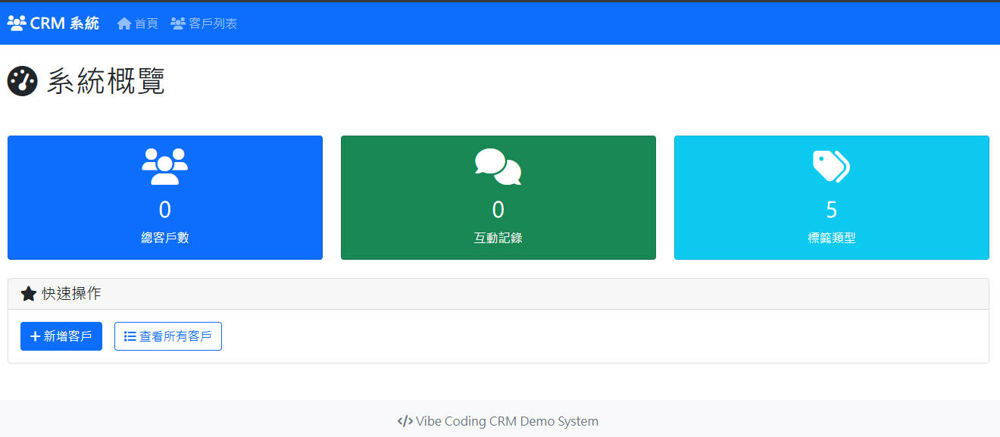

# CRM 
Vibe Coding CRM



1. 客戶管理系統
- 完整的客戶 CRUD 操作（新增、查看、編輯、刪除）
- 客戶基本資訊管理（姓名、電話、Email、地址、備註）
- 標籤系統（潛在客戶、已成交、跟進中、已流失、VIP客戶）
2. 互動記錄功能
- 客戶互動歷史記錄
- 支援電話、會議、Email、簡訊、拜訪等多種類型
- 時間軸式顯示互動記錄
3. 搜尋與篩選
- 依姓名、電話、Email 進行搜尋
- 依標籤篩選客戶
- 即時搜尋結果
4. 響應式前端介面
- 現代化 Bootstrap 5 設計
- Font Awesome 圖標
- 支援桌面和行動裝置
# 🚀 如何運行
1. 安裝依賴
```bash
pip install -r requirements.txt
```
2. 啟動應用
```bash
python app.py
```
3. 開啟瀏覽器 訪問 http://localhost:5000 開始使用
# 📁 專案結構
VibeCodingCRM/
├── app.py                 # 主應用程式  
├── requirements.txt       # 依賴套件  
├── templates/             # HTML 模板  
│   ├── base.html         # 基礎模板  
│   ├── index.html        # 首頁  
│   ├── customers.html    # 客戶列表  
│   ├── customer_form.html # 客戶表單  
│   ├── customer_detail.html # 客戶詳情  
│   └── interaction_form.html # 互動表單  
├── PRD.md                # 產品需求文件  
└── README.md             # 專案說明  
# 🔧 主要特色
- 記憶體儲存：所有資料暫存在記憶體中，適合演示用途
- 無需資料庫：輕量級實現，快速部署
- 完整功能：涵蓋 PRD 中所有核心需求
- 現代化 UI：美觀的用戶介面和操作體驗
